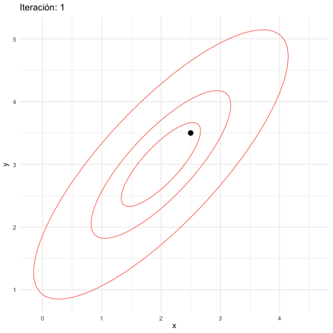
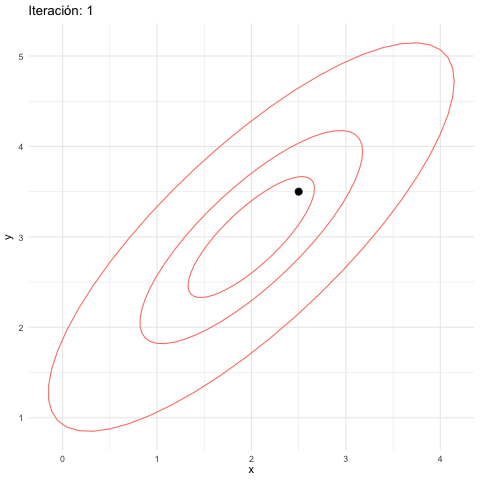
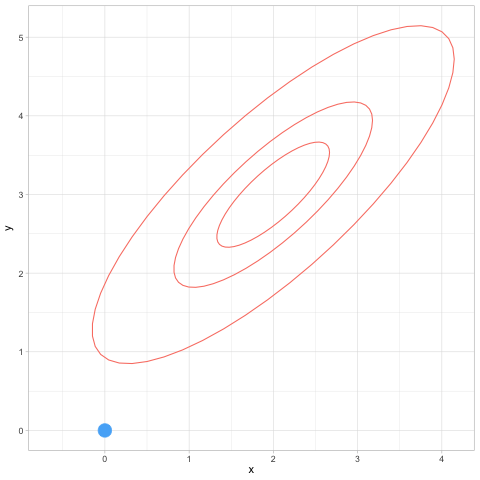
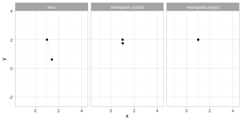

# Apéndice III: Monte Carlo Hamiltoniano {-}

```{r, echo=FALSE, message=FALSE, warning=FALSE}
library(tidyverse)
```


Recordemos la idea básica de MCMC


```{block,type="mathblock"}
**Idea básica de MCMC**

En MCMC, buscamos un cadena de Markov que, en el largo plazo, 
visite cada posible valor del parámetro proporcionalmente a la probabildad posterior
del parámetro. En el caso multivariado es la misma idea: cada combinación
de parámetros debe ser visitada por la cadena en proporción a su probabilidad
posterior.

```

### Balance detallado {-}

En la sección de Metrópolis introdujimos la intuición detrás de balance detallado 
y convergencia para el ejemplo de las islas, retomémoslo en términos mas generales.

Supongamos que en cada paso se cumple que (balance detallado):
$${q(x|y)}p(y) = {q(y|x)}{p(x)}$$
donde $q(x|y)$ son las probabilidades de transición de nuestra cadena de Markov
propuesta. Esta ecuación dice que la proporción de transiciones de $y$ a $x$ en relación a las transiciones de $x$ a $y$ es la misma que la proporción de probabilidad que hay entre $y$ y $x$ en la distribución objetivo.

Esta ecuación implica que si la probabilidad se distribuye como $p(x)$,
entonces al transicionar con $q$ la probabilidad fluje de manera que se mantiene
estática en $p$, es decir $p$ es una *distribución estacionaria* para la cadena de Markov producida por las transiciones.

Esto es fácil de demostrar pues
$$\sum_{y} q(x|y)p(y) = \sum_{y} q(y|x)p(x) = p(x) \sum_{y} q(y|x) = p(x).$$

Bajo otros supuestos adicionales de ergodicidad (aperiodicidad y tiempos de recurrencia finitos, es decir, las transiciones *mezclan* bien los estados),
entonces podemos simular la cadena de Markov por un tiempo suficientemente largo
y con esto obtener una muestra de la distribución objetivo $p$, es decir, la distribución estacionaria $p(x)$ también es la distribución de largo plazo para
cualquier cadena que simulemos.

¿Cómo podemos diseñar las $q(x|y)$ correspondientes? 

Comenzamos considerando distribuciones propuesta $q_0(x|y)$, y supondremos que nuestras transiciones tienen probabilidades simétricas $q_0(y|x) = q_0(x|y)$ (cómo en los ejemplos que vimos donde utilizamos Normales). 

* Entonces, cuando $p(y)/p(x) > 1$, queremos transicionar de $x$ a $y$ con más frecuencia que de $y$ a $x$.  Tiene sentido entonces que, comenzando en $x$, 
si la propuesta de $q_0(y|x)$ es $y$, pongamos que el sistema transicione con probabilidad 1. 

* Sin embargo, si empezamos en $y$ y la propuesta es $x$, ponemos que el sistema sólo transiciona de  $y$ a $x$  con probabilidad $p(x)/p(y)$ (esto es justamente la descripción de Metropolis Hastings).

* De esta manera, obtenemos que bajo $q(y|x)$, $x$ transiciona a $y$ 
con probabilidad $q_0(y|x)$ multiplicada por $\min\{1, p(y)/p(x)\}$. Entonces, el cociente
$\frac{q(y|x)}{q(x|y)}$ (usando también la simetría de $q_0(y|x)$), es igual a $\frac{p(y)}{p(x)}$ si $p(y)>p(x)$.
Si $p(x)>p(y)$, entonces siguiendo el mismo argumento, y por simetría de $q_0(y|x)$, se
cumple que el cociente de probabilidades es tambien igual a $\frac{p(y)}{p(x)}$. Esto demuestra
que se cumple el balance detallado.

De esta forma, balanceamos las transiciones de $q_0(y|x)$ modificando con el proceso
de aceptación y rechazo, para que la cadena de Markov resultante tenga la distribución
estacionaria $p(x)$, que es la distribución objetivo. 

Recordemos también que
**basta con conocer $p(x)$ módulo una constante de proporcionalidad** para poder
usar este algoritmo. Cuando lo usamos para simular posteriores esto es importante, pues
podemos utilizar $p(\theta|D)\propto p(D|\theta)p(\theta)$ sin tener que calcular
la integral $p(D)$ que normaliza el lado derecha de esta ecuación.

### Ejemplo: Metropolis bivariado {-}

Recordemos el ejemplo en que simulamos de una normal multivariada
con media en c(2,3) y matriz de covarianza $\Sigma$, que supondremos
es tal que la desviación estándar de cada variable es 1 y la correlación es
0.8. La matriz $\Sigma$ tiene 1 en la diagonal y 0.8 fuera de la diagonal.

La distribución objetivo $p$ está dada entonces (módulo una constante
de proporcionalidad):

```{r}
construir_log_p <- function(m, Sigma){
  Sigma_inv <- solve(Sigma)
  function(z){
    - 0.5 * (t(z-m) %*% Sigma_inv %*% (z-m))
  }
}
Sigma <- matrix(c(1, 0.8, 0.8, 1), nrow = 2)
m <- c(2, 3)
log_p <- construir_log_p(m, Sigma)
```

Nuestro algoritno de Metrópolis:

```{r}
# simulamos
M <- 50000
metropolis_mc <- function(M, z_inicial = c(0,0), log_p, delta_x, delta_y){
  z <- matrix(nrow = M, ncol = 2)
  z[1, ] <-z_inicial
  colnames(z) <- c("x", "y")
  rechazo <- 0
  for(i in 1:(M-1)){
    x_prop <- rnorm(1, z[i, 1], delta_x)
    y_prop <- rnorm(1, z[i, 2], delta_y)
    z_prop <- c(x_prop, y_prop)
    q <- exp(log_p(z_prop) - log_p(z[i, ]))
    if(runif(1) < q){
      z[i + 1, ] <- z_prop
    } else {
      rechazo <- rechazo + 1
      z[i + 1, ] <- z[i, ]
    } 
  }
  print(rechazo / M)
  z_tbl <- as_tibble(z) |> 
    mutate(n_sim = row_number())
  z_tbl
}
z_tbl <- metropolis_mc(M, c(2.5, 3.5), log_p, 1.0, 1.0)
```


Vemos que tenemos una tasa alta de rechazos. ¿Por qué? Veamos cómo se ven las simulaciones hasta 500 iteraciones:

```{r, echo=FALSE}
# estas las usamos para graficar
sims_normal <- mvtnorm::rmvnorm(100000, mean = m, sigma = Sigma)
colnames(sims_normal) <- c("x", "y")
sims_normal <- as_tibble(sims_normal)
elipses_normal <-list(stat_ellipse(data = sims_normal, aes(x, y), 
               level = c(0.9), type = "norm", colour = "salmon"),
  stat_ellipse(data = sims_normal, aes(x, y), 
               level = c(0.5), type = "norm", colour = "salmon"), 
  stat_ellipse(data = sims_normal, aes(x, y), 
               level = c(0.2), type = "norm", colour = "salmon"))
```


```{r}
graf_tbl <- map_df(seq(10, 500, 20), function(i){
  z_tbl |> filter(n_sim <= i) |> mutate(num_sims = i)
})
ggplot(graf_tbl, aes(x, y)) + 
  elipses_normal +
  geom_point(alpha = 0.1) +
  facet_wrap(~num_sims) + theme_minimal()
```

```{r, eval=FALSE}
library(gganimate)
anim_mh_1 <- z_tbl |> filter(n_sim < 50) |> 
  ggplot() + 
  geom_point(aes(x, y, group = n_sim), size = 3) +
  transition_reveal(n_sim) +
  elipses_normal +
  labs(title = 'Iteración: {frame_along}') +
  theme_minimal()
anim_save(animation = anim_mh_1, filename = "figuras/mh-1-normal.gif", 
          renderer = gifski_renderer())
```




**Observaciones**: 

- Los puntos que tienen intensidad alta son puntos donde hubo varios rechazos. Esto es porque las propuestas a veces caen en elipses de baja probabilidad (en la gráfica mostramos una elipse de 50% probabilidad y otra de 95%).
- Esto se debe a que los saltos en cada dirección son de desviación estándar 1, y esto fácilmente nos lleva a una zona de alta probabilidad a una de baja probabilidad.
- Sin embargo, a largo plazo, vemos cómo la cadena está visitando las regiones de alta probabilidad con aparentemente la frecuencia correcta.

Podemos entonces proponer saltos más chicos, por ejemplo:

```{r}
z_tbl <- metropolis_mc(M, c(2.5, 3.5), log_p, 0.2, 0.2)
graf_tbl <- map_df(seq(10, 500, 20), function(i){
  z_tbl |> filter(n_sim <= i) |> mutate(num_sims = i)
})
ggplot(graf_tbl, aes(x, y)) + 
  stat_ellipse(data = sims_normal, aes(x, y), 
               level = c( 0.9), type = "norm", colour = "salmon") +
  stat_ellipse(data = sims_normal, aes(x, y), 
               level = c( 0.5), type = "norm", colour = "salmon") +
  geom_point(alpha = 0.1) +
  facet_wrap(~num_sims) + theme_minimal()
```


```{r, eval=FALSE}
anim_mh_2 <- z_tbl |> filter(n_sim < 150) |> 
  ggplot() + 
  geom_point(aes(x, y, group = n_sim), size = 3) +
  transition_reveal(n_sim) +
  elipses_normal +
  labs(title = 'Iteración: {frame_along}') +
  theme_minimal()
anim_save(animation = anim_mh_2, filename = "figuras/mh-2-normal.gif", 
          renderer = gifski_renderer())
```




**Observaciones**: 

- En este caso tenemos una tasa de aceptación más alta.
- Sin embargo, la cadena parece "vagar" en la regiones de probabilidad alta,
y tiene dificultades para explorar correctamente estas regiones: se comporta localmente como una caminata aleatoria.
- Sin embargo, a largo plazo, vemos cómo la cadena está visitando las regiones de alta probabilidad con aparentemente la frecuencia correcta.


```{block,type="mathblock"}
En el algoritmo de Metropolis Hastings hay una tensión natural entre el tamaño
de salto y la tasa de aceptación. Si el tamaño de los saltos es muy grande, la tasa de aceptación puede ser baja y esto producen ineficiencias. Si el tamaño de los saltos es muy chico, la tasa de aceptación es más alta, pero esto también es ineficiente pues la cadena puede explorar muy lentamente el espacio de parámetros.
```

Existen métodos que pueden superar este problema, como son muestreo 
de Gibbs y Monte Carlo Hamiltoniano. El primero ya lo discutimos, y vimos que
requiere poder simular fácilmente de cada parámetro dados los otros, y esto
no siempre es posible. Veremos más el segundo, donde usaremos información
del gradiente de la distribución objetivo para proponer exploración más eficiente.


## Monte Carlo Hamiltoniano

Una manera de mejorar la exploración de Metropolis es utilizar una distribución
de propuestas más apropiada. La intuición en el caso anterior es: 

- Hay direcciones de más curvatura de la posterior que otras: movimientos relativamente chicos en las direcciones de alta curvatura nos llevan a regiones de probabilidad demasiado baja, y entonces tendemos a rechazar. Pero hacer movimientos aún más chicos para evitar rechazos nos lleva a explorar muy lentamente el espacio de parámetros.
- Podríamos evitar esto si nuestros saltos siguieran la curvatura natural de la distribución, como una pelota que rueda por la superficie de la distribución objetivo (con signo negativo, de forma que regiones de probabilidad alta sean valles o regiones bajas).

La idea de HMC es considerar el problema de muestrear de una distribución
como un problema físico, donde introducimos aleatoridad solamente en cuanto
a la "energía" de la pelota que va a explorar la posterior. Inicialmente
impartimos un momento tomado al azar a la pelota, seguimos su trayectoria
por un tiempo y el lugar a donde llega es nuestra nueva simulación. Esto 
permite que podamos dar saltos más grandes, sin "despeñarnos" en regiones de probabilidad muy baja y
al menos teóricamente, evitar del todo los rechazos (veremos que en la implementación
de todas formas necesitaremos implementar algunos rechazos para mejorar eficiencia).


Adicionalmente, veremos que si definimos el sistema físico apropiadamente,
es posible obtener ecuaciones de balance detallado, lo cual en teoría nos
garantiza una manera de transicionar que resultará a largo plazo en
una muestra de la distribución objetivo.


### Formulación Hamiltoniana 1: introducción {-}

Primero veremos cuál es la formulación Hamiltoniana (muy simple) 
de un sistema físico que
nos sirve para encontrar la trayectoria de partículas del sistema. Consideremos
una sola partícula cuya posición está dada por $q$, que suponemos en una sola
dimensión. La partícula rueda en una superficie cuya altura describimos
como $V(q)$, y tiene en cada instante tiene momento $p = m\dot{q}$. 

El Hamiltoniano
es la energía total de este sistema, en el *espacio fase* que describe el
estado de cada partícula dadas su momento y posición $(p,q)$, y es la suma de 
energía cinética más energía potencial:

$H(p,q) = T(p) + V(q)$

donde $V(q) = q^2/2$ está dada y $T(p) = \frac{p^2}{2m}$, de modo que 

$$H(p, q) = \frac{p^2}{2m} + V(q) = \frac{p^2}{2m} + \frac{q^2}{2}$$

Ahora consideremos las curvas de nivel de $H$ (energía total constante), 
que en este caso se conservan
a lo largo del movimiento de la partícula. Como sabemos por cálculo, estas curvas son perpendiculares al gradiente
del Hamiltoniano, que es $(\partial{H}/\partial{p}, \partial{H}/\partial{q})$.
 El movimiento
de las partículas, sin embargo, es a lo largo de las curvas de nivel, de manera
que el flujo instantáneo debe estar dado por el gradiente de $H$ rotado 90 grados, es decir, por $(\partial{H}/\partial{q}, -\partial{H}/\partial{p})$.

Entonces tenemos que el movimiento de la partícula debe cumplir las ecuaciones
de Hamilton:

$$\frac{dp}{dt} = -\frac{\partial{H}}{\partial{q}}, \frac{dq}{dt} = \frac{\partial{H}}{\partial{p}}$$
Simplificando y usando la definición de $H$, obtenemos que
$$\frac{dq}{dt} = \frac{p}{m}, \frac{dp}{dt} = -\frac{\partial{V}}{\partial{q}} = -q$$
Ilustramos este campo vectorial en la siguiente gráfica, donde escogemos $V(q) = q^2/2$, $m=1$, y dibujamos algunas curvas de nivel del Hamiltoniano:

```{r}
espacio_fase_1 <- tibble(q = seq(-3, 3, length.out = 1000), 
                         p = seq(-3, 3, length.out = 1000)) |> 
  tidyr::expand(q, p) |> 
  mutate(dq = p, dp = -q) |> 
  mutate(H = p^2/2 + q^2/2)
espacio_fase <- tibble(p = seq(-3, 3, length.out = 10), q = seq(-3, 3, length.out = 10)) |> 
  tidyr::expand(p, q) |> 
  mutate(dq = p, dp = -q)
espacio_fase |> 
  ggplot(aes(p, q)) +
  geom_contour(data = espacio_fase_1, aes(x = q, y = p, z = H)) +
  geom_segment(aes(xend = p + dp/5, yend = q + dq/5), 
               arrow = arrow(length = unit(0.1, "inches"))) +
  theme_minimal() +
  labs(subtitle = "Movimiento en espacio fase: 1 dimensión")
```

**Ojo**: este no es le movimiento de una partícula en dimensión 2: es el movimiento de la partícula en el espacio fase $(q,p)$, y la variable
de posición $q$ es de dimensión 1. Los ciclos de la gráfica muestran como
conforme la partícula se mueve, energía potencial y cinética se intercambian
a lo largo de su trayectoria en un "hilo" o curva de nivel.


### Formulación Hamiltoniana 2: densidades de probabilidad {-}

Consideremos
una partícula en el espacio de parámetros $\theta$. 
En esta formulación, si $\theta$ son
los parámetros de interés, consideramos la energía potencial del sistema
como 
$$V(\theta) = -\log p(\theta)$$ 

donde $p(\theta)$ es la distribución objetivo. 

Buscamos
simular del sistema con ecuaciones de movimiento para $\theta$. Como hicimos
antes, vamos a "levantar" al espacio fase incluyendo el momento, que denotaremos como $\rho$. La energía cinética, en el caso más simple,
podemos definirla (en la práctica existen reescalamientos) como 
como 
$$T(\rho) =\frac{1}{2}\sum_i \rho_i^2$$

la energía cinética es proporcional al momento cuadrado, pues el momento es masa 
por velocidad.

El Hamiltoniano por definición $H(\rho, \theta) = T(\rho) + V(\theta)$, y las ecuaciones de Hamilton son las mismas que arriba, que en este caso nos dan

$$\frac{d\theta}{dt} = \rho, \frac{d\rho}{dt} = \nabla(\log(p(\theta)).$$

Si resolvemos estas ecuaciones, podemos entonces simular del sistema como
sigue:

1. Dado un punto inicial $\theta$, escogemos un momento inicial $\rho$ al azar, por ejemplo cada componente normal $N(0,1)$ (en la práctica existe un reescalamiento, pero en general queremos que $p(\rho) = p(-\rho)$). Es decir, agregamos inicialmente una cantidad aleatoria de energía a la partícula.
2. Usando las ecuaciones de Hamilton, actualizamos la posición $\theta$ 
y el momento de la partícula un cierto tiempo $t$ fijo, de manera que no quedemos muy cerca
del valor inicial, pero tampoco hagamos demasiado trabajo computacional.
3. La posición nueva $\theta^*$ es aceptada como nuestra nueva simulación 
(si el paso 2 es *exacto*, pero frecuentemente no lo es).
4. Repetimos los pasos 1-3 un número suficiente de veces para obtener
simulaciones de la posterior.

Este método produce simulaciones de la distribución objetivo bajo condiciones de regularidad. Podemos demostrar
por ejemplo, que se cumple el balance detallado.

### Balance detallado para HMC {-}

Supongamos que las transiciones que da este sistema son $q(y|x)$. Nótese
que dado el momento simulado, tenemos el estado $(\rho, x)$, y 
la transición $x\to y$ es determinista,
gobernada por las ecuaciones de Hamilton. Escribimos la transición como
$$(\rho, x) \to (\rho^*, y).$$
Nótese que $\rho$ y $x$ determinan la transición, de modo que

$$p(x)q(y|x) = p(x)p(\rho) = \exp(-H(\rho, x)) = \exp(-H(\rho^*, y))$$
Que es cierto por conservación de la energía total y la transición
sigue exactamente trayectorias del Hamiltoniano. Esta última cantidad,
usando un argumento similar, es igual a

$$p(y)p(\rho^*) = p(y)p(-\rho^*) = p(y) q(x|y)$$
La segunda igualdad se da porque $p(\rho)$ es Gaussiana (simétrica). Y finalmente,
la última igualdad se da porque si necesitamos momento $\rho$ para llegar de $x$ a $(\rho^*, y)$, entonces necesitamos $-\rho^*$ (volteamos la velocidad ifnal) para llegar de $y$ a $(\rho, x)$, pues el sistema físico es reversible.

Nótese que este argumento se rompe si por ejemplo si es imposible transicionar
de un punto a otro (por ejemplo, cuando la distribución objetivo $p$ tiene dos
regiones separadas de probabilidad positiva).


### Integración de las ecuaciones de Hamilton {-}

Para aproximar soluciones de estas ecuaciones diferenciales utilizamos
el integrador [leapfrog](https://en.wikipedia.org/wiki/Leapfrog_integration), 
en el que hacemos actualizaciones alternadas
de posición y momento con un tamaño de paso $\epsilon$ chico. Hacemos este
paso un número $L$ de veces, para no quedar muy cerca del valor inicial.

En nuestro ejemplo, actualizaríamos por ejemplo el momento a la mitad del paso:

$$\rho_{t+\epsilon/2} = \rho_t - \frac{\epsilon}{2}\nabla(\log(p(\theta_t)))$$
Seguido de una actualización de la posición:

$$\theta_{t+\epsilon} = \theta_t + \epsilon \rho_{t+\epsilon/2}$$
y finalmente otra actualización del momento:

$$\rho_{t+\epsilon} = \rho_{t+\epsilon/2} - \frac{\epsilon}{2}\nabla(\log(p(\theta_{t+\epsilon})))$$
Al final de este proceso, encontraremos que por errores numéricos, quizá
el Hamiltoniano varió un poco. Si esto sucede, podemos hacer un
paso de aceptación y rechazo como en Metropolis Hastings, donde la probabilidad
de aceptar es

$$\min\left(1, \exp(H(\rho,\theta) - H(\rho^{*},\theta^{*}))\right)$$
donde $\rho^{*}$ y $\theta^{*}$ son los valores de momento y posición nuevos
y $H(\rho,\theta)$ es el Hamiltoniano en el paso anterior.

**Observaciones**:

1. Un caso posible obtengamos desbordes o casi desbordes numéricos
del momento o la posición (el Hamiltoniano en el punto inicial es órdenes
de magnitud diferente que el inicial, ver [el manual de Stan](https://mc-stan.org/docs/reference-manual/mcmc.html#divergent-transitions) ). Esto indica
problemas graves con el algoritmo de integración, y en general marcamos
estas iteraciones como **divergentes**. Estas fallas pueden producir, como
veremos, exploración insuficiente de la distribución objetivo.
2. Si queremos usar HMC directamente, es delicado afinar el tamaño de paso,
la distribución de propuesta para el momento, y el número de saltos $L$. En
Stan, que usa una variación de HMC, estos valores son ajustados
en el periodo de calentamiento o *warmup*, antes de 


### Ejemplo: HMC en una distribución normal bivariada {-}

Primero calculamos el gradiente que requerimos. En este caso, podemos
hacerlo analíticamente:

```{r}
construir_log_p <- function(m, Sigma){
  Sigma_inv <- solve(Sigma)
  function(z){
    - 0.5 * (t(z-m) %*% Sigma_inv %*% (z-m))
  }
}
Sigma <- matrix(c(1, 0.8, 0.8, 1), nrow = 2)
m <- c(2, 3)
log_p <- construir_log_p(m, Sigma)
# en diferenciación automática, el siguiente constructor
# puede tomar como argumento log_p, pero aquí la escribimos
# explícitamente
construir_grad_log_p <- function(m, Sigma){
  Sigma_inv <- solve(Sigma)
  function(theta){
    - Sigma_inv %*% (theta-m)
  }
}
grad_log_p <- construir_grad_log_p(m, Sigma)
construir_H <- function(m, Sigma){
  Sigma_inv <- solve(Sigma)
  function(theta, rho){
    - log_p(theta) + 0.5 * sum(rho^2)
  }
}
H <- construir_H(m, Sigma)
log_p(c(1,3))
grad_log_p(c(1,3))
```

Ahora, implementamos el algoritmo de HMC. Primero, definimos una función

```{r}
hamilton_mc <- function(n, theta_0 = c(0,0), log_p, grad_log_p, epsilon, L){
  p <- length(theta_0)
  theta <- matrix(0, n, p)
  theta[1, ] <- theta_0
  rho <- matrix(0, n, p)
  theta_completa <- matrix(0, n*L, p)
  theta_completa[1, 0] <- theta_0
  rho_completa <- matrix(0, n*L, p) 
  indice_completa <- 2
  rechazo <- 0
  for(i in 2:n){
    prop_rho <- rnorm(p)
    rho[i-1, ] <- prop_rho
    prop_theta <- theta[i-1, ]
    for(t in 1:L){
      prop_rho <- prop_rho + 0.5 * epsilon * grad_log_p(prop_theta)
      prop_theta <- prop_theta + epsilon * prop_rho 
      prop_rho  <- prop_rho + 0.5 * epsilon * grad_log_p(prop_theta)
      theta_completa[indice_completa,] <- prop_theta
      rho_completa[indice_completa,] <- prop_rho
      indice_completa <- indice_completa + 1
    }
  
    q <- min(1, exp(H(theta[i-1, ], rho[i-1, ]) - 
                  H(prop_theta, prop_rho))) 
    if(runif(1) < q){
      theta[i, ] <- prop_theta
    } else {
      rechazo <- rechazo + 1
      theta[i, ] <- theta[i-1, ]
      rho[i, ] <- rho[i-1, ]
      theta_completa[indice_completa - 1,] <- theta[i-1, ]
      rho_completa[indice_completa - 1,] <- rho[i-1, ]
    } 
  }
  print(rechazo / n)
  list(sims = tibble(x = theta[,1], y = theta[,2]),
       trayectorias = tibble(x = theta_completa[,1], y = theta_completa[,2]) |>
         mutate(iteracion = rep(1:n, each = L), paso = rep(1:L, times = n)))
}

```


Revisamos que la muestra aproxima apropiadamente nuestra distribución

```{r}
set.seed(10)

hmc_salida <- hamilton_mc(1000, c(0,0), log_p, grad_log_p, 0.2, 12)

ggplot(hmc_salida$sims, aes(x = x, y = y)) + geom_point() +
  stat_ellipse(data = sims_normal, aes(x, y), 
               level = c(0.9), type = "norm", colour = "salmon") +
  stat_ellipse(data = sims_normal, aes(x, y), 
               level = c( 0.5), type = "norm", colour = "salmon") +
  stat_ellipse(level = c( 0.9), colour = "green", type = "norm") +
  stat_ellipse(level = c( 0.5), colour = "green", type = "norm") 
```

```{r}
tray_tbl <- hmc_salida$trayectorias
head(tray_tbl)
```


```{r, eval=FALSE}
library(gganimate)
anim_hmc <- ggplot(tray_tbl |> mutate(iter = 4*as.numeric(paso == 1), 
                          s = as.numeric(paso == 2)) |> 
         filter(iteracion < 30) |> 
         mutate(tiempo = row_number()) |> 
         mutate(tiempo = tiempo + cumsum(50 * s)), 
       aes(x = x, y = y)) + 
    geom_point(aes(colour = iter, alpha = iter, size = iter, group = tiempo)) +
    geom_path(colour = "gray", alpha = 0.5) +
  transition_reveal(tiempo) +
  elipses_normal +
  theme(legend.position = "none") 
anim_save(animation = anim_hmc, filename = "figuras/hmc-normal.gif", 
          renderer = gifski_renderer())
```




**Observaciones**:

- Nótese que ahora podemos dar pasos más grandes a lo largo de los lugares
donde concentra mayor probabilidad.
- Esto implica dos cosas: evitamos el comportamiento de caminata aleatoria (pasos muy cortos), y también tasas de rechazo alto (cuando los pasos son muy grandes en MH)
- El algoritmo utiliza información adicional: además de calcular la posterior, como en metropolis, es necesario calcular también el gradiente de la posterior.
- Este algoritmo hace más trabajo para cada iteración (requiere la integración leapfrog), pero cada iteración es más informativa
- Bien afinado, funciona para problemas de dimensión alta (cientos o miles de parámetros), donde geométricamente la densidad está concentrada en un espacio geométricamente chico. Existen todavía dificultades que discutiremos en otros modelos más adelante.

Observamos que hasta ahora no hemos aplicado estos algoritmos para simular
de la posterior de un modelo: hemos tomado distribuciones fijas y usamos MCMC para simular de ellas. El proceso para una posterior es el mismo, pero usualmente más complicado pues generalmente involucra mucho más parámetros y una
posterior que no tiene una forma analítica conocida.

Sin embargo, la aplicación para una posterior es la misma: siempre podemos
calcular el logaritmo de la posterior (al menos hasta una constante de proporcionalidad), y siempre podemos usar diferenciación automática para 
calcular el gradiente de la log posterior. Podemos aplicar entonces HMC o Metropolis.


### Comparación de HMC y Metropolis {-}

Finalmente, haremos una comparación 
entre el desempeño de HMC y Metropolis en el caso de la distribución normal.
Utilizaremos otra normal bivariada con más correlación.

```{r}
set.seed(737)
Sigma <- matrix(c(1, -0.9, -0.9, 1), nrow = 2)
m <- c(1, 1)
log_p <- construir_log_p(m, Sigma)
grad_log_p <- construir_grad_log_p(m, Sigma)
system.time(hmc_1 <- hamilton_mc(1000, c(1,2), log_p, grad_log_p, 0.2, 12))
system.time(metropolis_1 <- metropolis_mc(1000, c(1,2), log_p, 0.2, 0.2))
system.time(metropolis_2 <- metropolis_mc(1000, c(1,2), log_p, 1, 1))

```

```{r, fig.width=10, fig.height=5, eval=FALSE}
sims_hmc <- hmc_1$sims |> mutate(n_sim = row_number()) |> 
  mutate(algoritmo = "hmc")
sims_metropolis_1 <- metropolis_1 |> 
  mutate(algoritmo = "metropolis (corto)") 
sims_metropolis_2 <- metropolis_2 |> 
  mutate(algoritmo = "metropolis (largo)") 
sims_comp <- bind_rows(sims_hmc, sims_metropolis_1, sims_metropolis_2)
anim_comp <- ggplot(sims_comp |> filter(n_sim < 200)) + 
  transition_reveal(n_sim) +
  theme(legend.position = "none") +
  geom_path(aes(x, y), colour = "gray", alpha = 0.2) + 
    geom_point(aes(x, y, group = n_sim)) +
  facet_wrap(~algoritmo)
anim_save(animation = anim_comp, filename = "figuras/comparacion-normal.gif", height = 250, width = 500,
          units = "px",
          renderer = gifski_renderer())
```

 

** Comparaciones de eficiencia**
Nótese que en general **no tiene sentido** comparar algoritmos usando el número
de simulaciones que puede producir por unidad de tiempo. La comparación correcta
involucra comparar cuánto *tiempo* requerimos para aproximar con cierto grado
de precisión a la posterior (o más bien, resúmenes de la posterior). Algunos algoritmos
son pueden ser rápidos porque producen rápidamente muchas simulaciones poco informativas,
y otros son rápidos porque cada simulación que producen es muy informativa.
Veremos más adelante el concepto de *muestra efectiva*.


### HMC en Stan {-}

En Stan se incluyen tres componentes adicionales importantes para
estimar posteriores de manera eficiente:

1. Periodos de *warm-up* (calentamiento) y *sampling* (muestreo). En el periodo de calentamiento, el muestreador afina tamaños de paso, escalamiento de la distribución de propuesta (normal multivariada), y otros parámetros de manera automática.
2. Implementación de [diferenciación automática](https://en.wikipedia.org/wiki/Automatic_differentiation) para no tener que calcular el grandiente de la log posterior directamente. A partir del código que damos, se crean automáticamente funciones que calculan el grandiente (no es una aproximación numérica).
3. Implementación de HMC sin vueltas en U (NUTS): una afinación adicional es dinámicamente adaptar el número de pasos de integración para evitar "regresos", como vimos que sucedía en los ejemplos de arriba. Ver por ejemplo [aquí](https://elevanth.org/blog/2017/11/28/build-a-better-markov-chain/), o
la documentación de Stan.


## Diagnósticos adicionales

Adicional a los diagnósticos que vimos en la sección de MCMC, Stan
provee diagnóstivos adicionales relacionados al HMC. Cuando una 
trayectoria tuvo un cambio grande en energía $H$ desde
su valor actual a la propuesta final, usualmente del orden de 10^3 por ejemplo, esto implica un rechazo
"fuerte" en el nuevo punto de la trayectoria, e implica que la el integrador numérico
falló de manera grave. 

### Transiciones divergentes {-}

Cuando en Stan obtenemos un número considerable de transiciones divergentes, generalmente
esto indica que el integrador numérico de Stan no está funcionando bien, y por lo tanto
la exploración puede ser deficiente y/o puede estar sesgada al espacio de parámetros donde
no ocurren estos rechazos.


Esto puede pasar cuando encontramos zonas de alta curvatura en el espacio de parámetros.
Que una posterior esté altamente concentrada o más dispersa generalmente no es un problema,
pero si la concentración varía fuertemente (curvatura) entonces puede ser difícil encontrar la
escala correcta para que el integrador funcione apropiadamente.

#### El embudo de Neal {-}

Para ver un ejemplo, consideremos un ejemplo de una distribución cuya forma 
es común en modelos jerárquicos. Primero, la marginal de $y$ es normal con media
0 y desviación estándar 3. La distribución condicional $p(x|y)$ 
de $x = c(x_1,\ldots, x_9)$ dado $y$ es normal multivariada, todas con media
cero y desviación estándar $e^{y/2}$. Veamos qué pasa si intentamos simular de 
esta distribución en Stan:


```{r}
library(cmdstanr)

mod_embudo <- cmdstan_model("stan/embudo-neal.stan")
ajuste_embudo <- mod_embudo$sample(
  chains = 1,
  iter_warmup = 1000,
  iter_sampling = 3000,
  refresh = 1000)
```

Y vemos que aparecen algunos problemas.

```{r}
simulaciones <- ajuste_embudo$draws(format = "df")
diagnosticos <- ajuste_embudo$sampler_diagnostics(format = "df")
sims_diag <- simulaciones |> inner_join(diagnosticos, by = c(".draw", ".iteration", ".chain"))
ajuste_embudo$summary() |>
  select(variable, mean, rhat, contains("ess"))
ggplot(sims_diag, aes(y = y, x = `x[1]`)) +
  geom_point(alpha = 0.1) +
  geom_point(data = sims_diag |> filter(divergent__ == 1), color = "red", size = 2) +
  geom_hline(yintercept = -2.5, linetype = 2)
```

Y vemos que hay transiciones divergentes. Cuando el muestreador entra en el cuello
del embudo, es muy fácil que se "despeñe" en probabilidad y que no pueda
explorar correctamente la forma del cuello. Esto lo podemos ver, por ejemplo, si
hacemos más simulaciones:


```{r}
mod_embudo <- cmdstan_model("stan/embudo-neal.stan")
print(mod_embudo)
ajuste_embudo <- mod_embudo$sample(
  chains = 1,
  iter_warmup = 1000,
  iter_sampling = 30000,
  refresh = 10000)
ajuste_embudo$summary() |>
  select(variable, mean, rhat, contains("ess"))
simulaciones <- ajuste_embudo$draws(format = "df")
diagnosticos <- ajuste_embudo$sampler_diagnostics(format = "df")
sims_diag <- simulaciones |> inner_join(diagnosticos, by = c(".draw", ".iteration", ".chain"))
ggplot(sims_diag, aes(y = y, x = `x[1]`)) +
  geom_point(alpha = 0.1) +
  geom_point(data = sims_diag |> filter(divergent__ == 1), color = "red", size = 2) +
  geom_hline(yintercept = -2.5, linetype = 2)
```

Y vemos que ahora que en el primer ejemplo estábamos probablemente sobreestimando
la media de $y$. Las divergencias indican que esto puede estar ocurriendo. En este ejemplo
particular, también vemos que las R-hat y los tamaños efectivos de muestra son bajos.

Este es un ejemplo extremo. Sin embargo, podemos *reparametrizar* para hacer las cosas más
fáciles para el muestreador. Podemos simular $y$, y después, simular
$x$ como $x \sim e^{y/2} z$ donde $z$ es normal estándar.


```{r}
mod_embudo_reparam <- cmdstan_model("stan/embudo-neal-reparam.stan")
print(mod_embudo_reparam)
ajuste_embudo <- mod_embudo_reparam$sample(
  chains = 4,
  iter_warmup = 1000,
  iter_sampling = 10000,
  refresh = 1000)
```

Y con este truco de reparametrización el muestreador funciona correctamente
(observa que la media de $y$ está estimada correctamente, y no hay divergencias).

```{r}
ajuste_embudo$summary() |>
  select(variable, mean, rhat, contains("ess")) |>
  mutate(across(c(mean, rhat, ess_bulk, ess_tail), ~round(., 3)))
```


